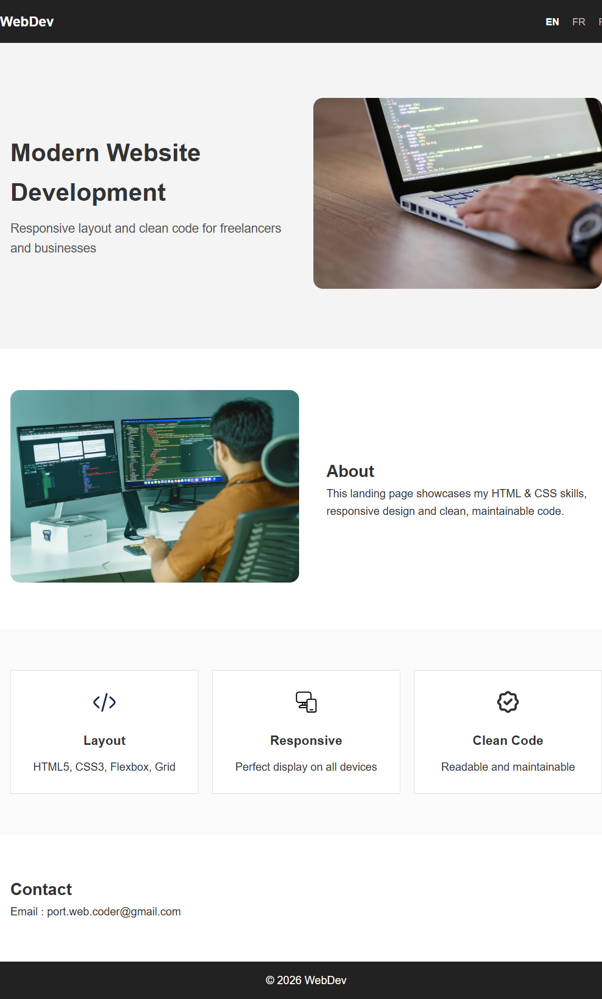

# 🌐 Web Integrator / Frontend Developer

Personal portfolio showcasing my frontend projects and skills.  
Focused on clean HTML, modern CSS, and interactive JavaScript.

---

## 👋 About Me

I am a **Web Integrator / Junior Frontend Developer**.  
I specialize in:
- semantic HTML markup
- responsive layouts
- adding interactivity with vanilla JavaScript

I enjoy turning designs into clean, functional websites and continuously improving my skills.

---

## 🛠️ Skills

- HTML5 (semantic markup)
- CSS3 (Flexbox, Grid)
- Responsive design
- JavaScript (DOM manipulation, events)
- Git & GitHub
- Basic UI/UX understanding

---

## 📂 Projects

### 🔹 Landing Page (HTML & CSS)
**Description:**  
Responsive landing page built with semantic HTML and modern CSS.

**Features:**
- Clean layout
- Responsive design
- Flexbox-based structure

🔗 Live Demo:  
https://oleksandrwebdew.github.io/landing/

💻 GitHub:  
https://github.com/oleksandrwebdew/landing

---

### 🔹 Interactive UI Components (JavaScript)
**Description:**  
A collection of UI elements built with vanilla JavaScript.

**Features:**
- Modal window
- Slider
- Burger menu
- Smooth scrolling

🔗 Live Demo:  
https://oleksandrwebdew.github.io/interactive-site/

💻 GitHub:  
https://github.com/oleksandrwebdew/interactive-site

---

### 🔹 Task Manager (Vanilla JavaScript)
**Description:**  
A task management app built with pure JavaScript and LocalStorage.

**Features:**
- Add / delete tasks (CRUD)
- Task filtering (All / Active / Completed)
- Task counter
- Data persistence with LocalStorage

🔗 Live Demo:  
https://oleksandrwebdew.github.io/task-manager/

💻 GitHub:  
https://github.com/oleksandrwebdew/task-manager

---

### 📸 Project Screenshots

  
  
  

---

## 📬 Contact

- 📧 Email: port.web.coder@gmail.com  
- 💬 Telegram: @port_web_coder  
- 💻 GitHub: https://github.com/oleksandrwebdew

---

## 🚀 Goal

I am currently looking for **junior frontend / web integrator opportunities** and freelance projects.  
Open to learning, feedback, and collaboration.
